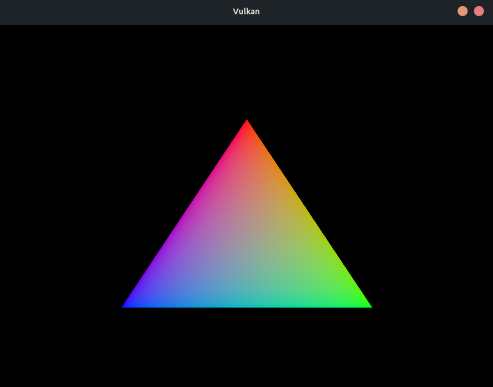

# Vulkan Project
Cross-platform vulkan project example



---

# Building Process

## Prerequisites

### All Platforms
- [Vulkan SDK](https://vulkan.lunarg.com/sdk/home)
- [CMake](https://cmake.org/download/) 3.16+
- C++17 compiler

### Windows
- [GLFW](https://www.glfw.org/download.html) — easiest via [vcpkg](https://vcpkg.io/):
```bat
  vcpkg install glfw3:x64-windows
```


### Linux
```bash
sudo apt install cmake libglfw3-dev libvulkan-dev glslc
```

### macOS
```bash
brew install cmake glfw
```
MoltenVK is included with the Vulkan SDK on macOS.

---

## Build

### Windows
```bat
cmake -B build -S . -DCMAKE_TOOLCHAIN_FILE=[vcpkg root]/scripts/buildsystems/vcpkg.cmake
cmake --build build --config Release
```

### Linux & macOS
```bash
mkdir build && cd build
cmake ..
cmake --build . -j8
```

---

## Shaders

Shaders are compiled automatically during `cmake --build . -j8`. GLSL source files in `shaders/` are compiled to `.spv` by `glslc`.

On Windows, make sure the Vulkan SDK `Bin` directory (e.g. `C:\VulkanSDK\<version>\Bin`) is on your `PATH`.

On linux and macOS, source the SDK setup script if `glslc` is not found:
```bash
source ~/VulkanSDK/<version>/setup-env.sh
```

---

## Running

### Windows
```bat
.\build\Release\VulkanProject.exe
```

### Linux & macOS
```bash
./build/VulkanProject
```
